# Start here
## Introduction
*Note: The introduction was written on 21.12 2024* 

Before getting started, we’ll walk you through configuring your smart LED lights.
First, you’ll use the app to set up and control your lights. Then, we’ll guide you 
through setting up your Tuya account. After that, you’ll configure Spotify and 
authorize it with the website. The entire process should take about 15 minutes. 
Good news: this setup only needs to be done ONCE per account.

# Configure your L.E.D Light

## Step 1: Check Tuya API Compatibility

The first step is to check if your LED lights are compatible with the Tuya API. 
You can do this by visiting the following website and searching for the name of your LED lights:  
[Smart Life App Compatible Devices](https://smart-leuchten.de/smart-life-app-kompatible-geraete/)  

If the name of your lights doesn’t appear, don’t worry—there’s still hope!

## Step 2: Register on Tuya Developer

Next, we’ll register on the Tuya Developer platform:  
[Tuya Developer Login](https://auth.tuya.com/?from=https://auth.tuya.com/login/silent?from%3Dhttps%253A%252F%252Fwe.platform.tuya.com%252Fcloud%252Fdevice%252Fdetail%252F%253Fid%253Dp1712411152763rmsfmt%2526deviceId%253D9ba70c86fd24fbe4721del%2526search%253D9ba70c86fd24fbe4721del%2526sourceId%253D151173183%2526sourceType%253D6%2526region%253DWE)

After registering and logging in, you should land on the main page, which might seem overwhelming at first.

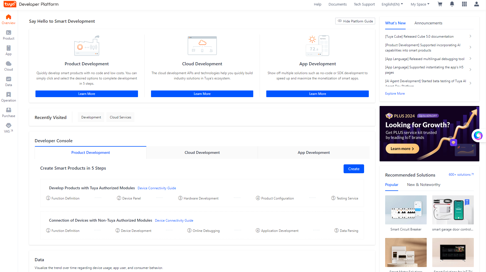

## Step 3: Create a Project

First, click on **Cloud** in the left-hand menu, then select **Development**. On the right side, you’ll see a blue button labeled **Create Project**—click it to proceed.

When creating the project, the **Name** and **Description** are not critical. Focus on selecting the correct options:

- **Industry**: Choose **Smart Home**.
- **Development Method**: Select **Custom**.
- **Data Center**: Pick the data center corresponding to your region.

After configuring these settings, click **Ok** to complete your project setup. You'll be directed to your project dashboard, where you can find your API keys and other configurations.

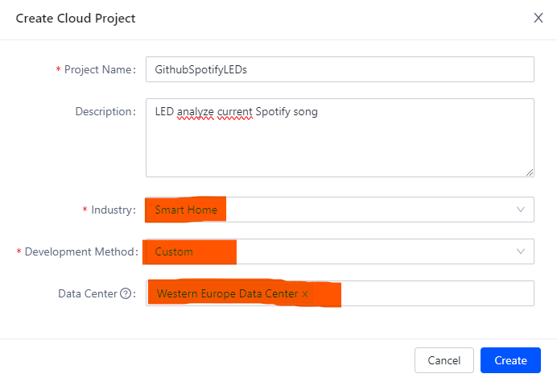

We can skip all proposed APIs

## Step 4: Retrieve Your Access ID and Secret

Now, you’ll see your **Access ID/Client ID** and **Access Secret/Client Secret**.  
**Very important!** Make sure to note these down, as we will need them for our website configuration.

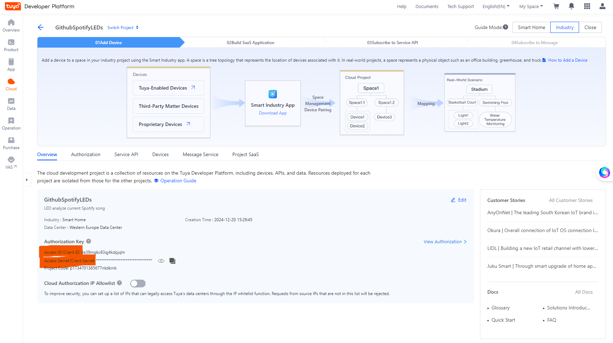

## Step 5: Free Subscription (No Payment / Credit Card Information)

Now, we come to the sketchy part. Tuya offers their API service only with a subscription.  

**Pros**: You can claim a free month without entering any payment information.  
**Cons**: After one month, you’ll need to request another trial extension, which will extend it for 6 more months. The request process was quick for me, taking about 3-5 minutes, but I’m unsure if this can be requested again after the 6-month period.

First, go back to **Cloud** under **Development**, where you should now see your project.  
Click on **Upgrade IoT Core Plus** to proceed.

Select **Trial Edition** and click the **Buy Now** button. Nothing else is needed here.

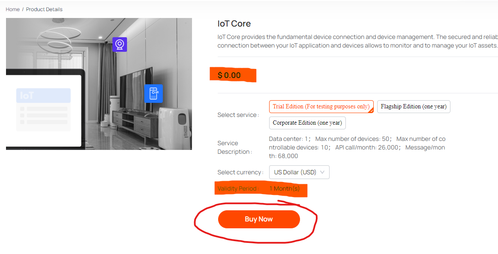

Finally, confirm your free trial and select your project.

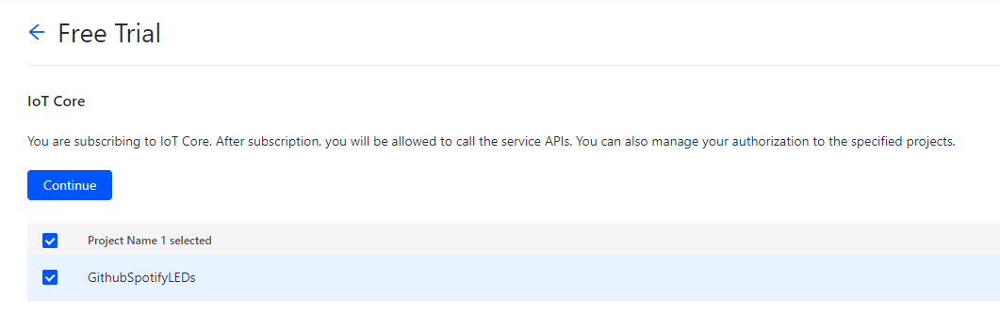

## Step 6: Set Up Your Device

Enter in your project again, under **Clound** into **Develepment** and Click on **Devices**, where you’ll see a visual guide of the steps ahead.  
In the bottom right corner, click on **Add Devices** and select **Add with Smart Industry App**.  
A QR code should now appear on your screen.
The QR code will direct you to the **Smart Industry** app, which we will need for the next steps.

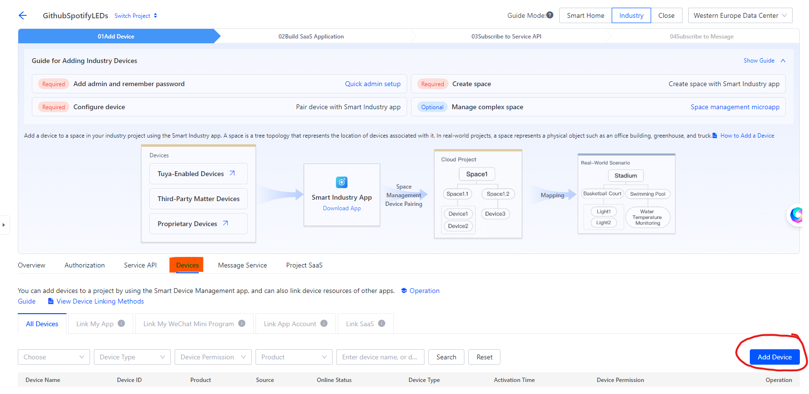

## Step 6.5: Create an Admin Account

Before working with the app, we need to create an **Admin** account.  
Click on **Show Guide** for more details and select **Quick Admin Setup** to proceed.

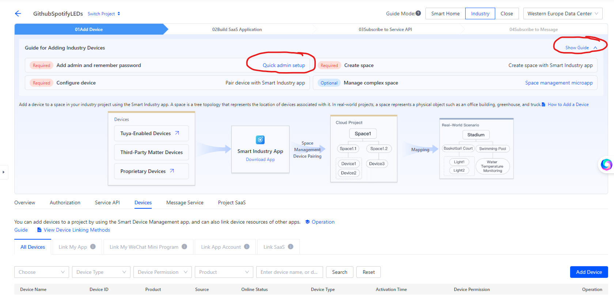

After choosing either an email or phone number, the QR code should appear.

Now, let's create a password.  

Go to **02 Build SaaS Application** and reset your password.  
Make sure to note down the generated password!

## Step 7: Smart Industry

In the app, the first bar will prompt you to scan the same QR code you scanned earlier. If done correctly, your project name should be automatically filled in.  
**Important!** For **Account** and **Password**, use your **Admin Email** and the **generated password**.

In the home menu, click on **Me** at the bottom right, then go to **Asset Management** and click on **+Add**.

After creating any asset, return to the home screen and switch from **All Devices** to the asset you just created.  
Finally, click on **+Add** to find your smart device. Make sure your smart device is in pairing mode.  
(Note: Enabling pairing mode varies by device. Often, you need to press and hold a specific button, such as the **On/Off** button, for a longer period.)

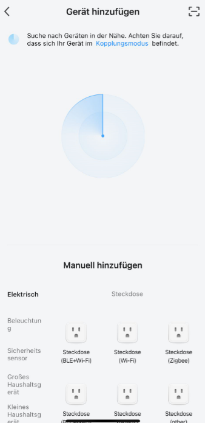

## Last Step: Device ID

After connecting your lights with the app, go back to **Cloud** under **Development** and check **Devices**. You should now see your active smart device, including the **Device ID**.  

Take a deep breath!  
The hardest part is behind us. The Spotify configuration is much simpler!

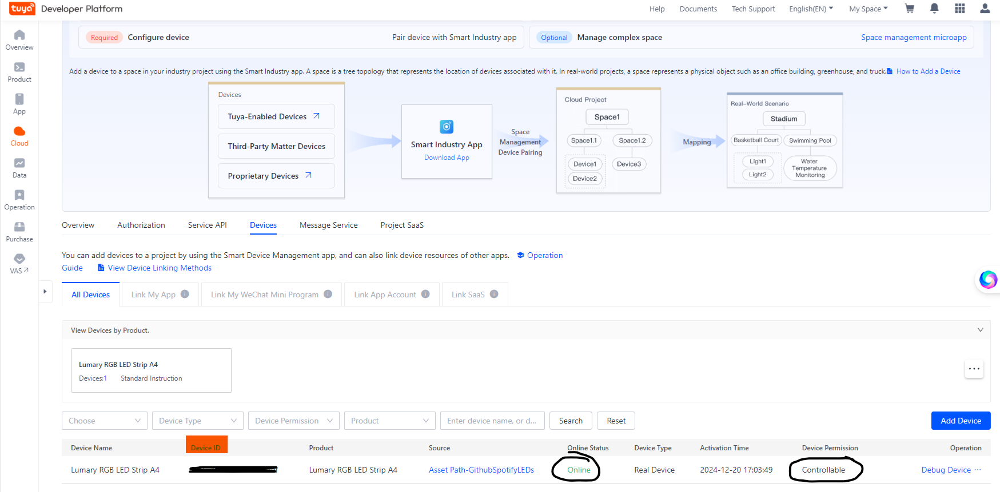

## Final Check!

Once you've correctly transferred everything to the website, you can now toggle your lights on and off using the switch in the top right corner.

# Configure your Spotify

## Step 1: Log in

Log in to the Spotify Developer platform at
[Spotify Developer](https://developer.spotify.com/)
Click on your profile in the top right corner and select **Dashboard**.  
You should now see the following:

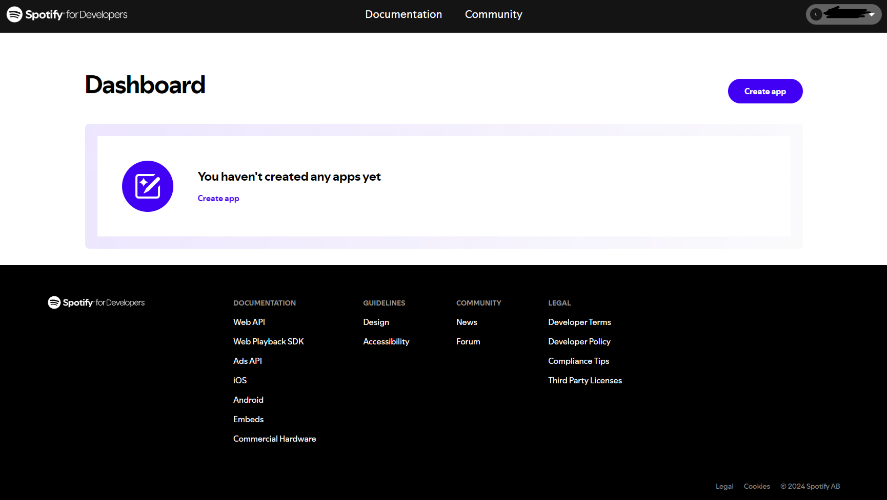

## Step 2: Create App

When creating the app, the **name** and **description** don't matter. The key part is to provide the correct **Redirect URIs**. I’ve intentionally added more than necessary to prevent any potential issues.  
For **API used**, select **Web API**.

## Step 3: Final Step

After creating your app, you'll be on the home screen. Click on **Settings** to view your **Client ID** and **Client Secret**.

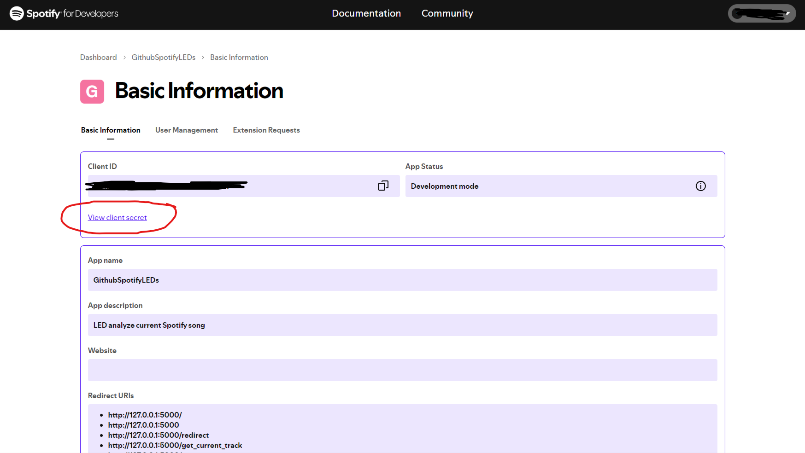

## Final Check!

Once you've correctly transferred the data to Spotify, click on **Home** in the menu. You will be asked to confirm the connection again.

Now you're done! Play a song and try it out yourself!

